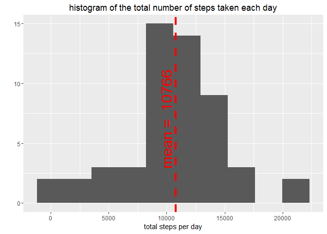
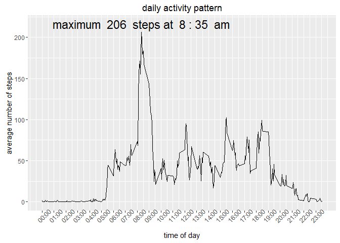
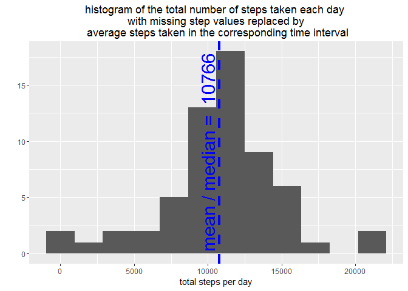
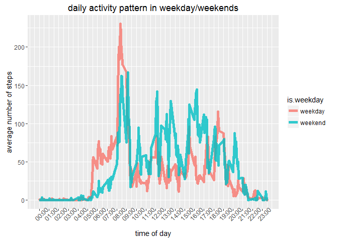
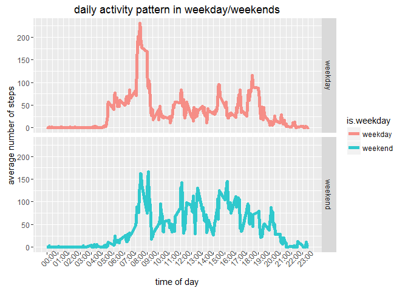

# Reproducible Research: Peer Assessment 1
Dexter Wang  
`r format(Sys.time(), '%d/%m/%Y')`  


## Loading and preprocessing the data


```r
setwd("C:/D/R/Output Repo/Assignments Temp Repo/RepData_PeerAssessment1")

unzip("activity.zip")

data <- read.csv("./activity.csv",sep = ",",header= TRUE)

data$date <- as.Date(as.character(data$date),"%Y-%m-%d") 


str(data)
```

```
## 'data.frame':	17568 obs. of  3 variables:
##  $ steps   : int  NA NA NA NA NA NA NA NA NA NA ...
##  $ date    : Date, format: "2012-10-01" "2012-10-01" ...
##  $ interval: int  0 5 10 15 20 25 30 35 40 45 ...
```

```r
head(data)
```

```
##   steps       date interval
## 1    NA 2012-10-01        0
## 2    NA 2012-10-01        5
## 3    NA 2012-10-01       10
## 4    NA 2012-10-01       15
## 5    NA 2012-10-01       20
## 6    NA 2012-10-01       25
```

####There are 17568 observations in the dataset, dated from 2012-10-01 to 2012-11-30. Each day has 288 observations. Each records the number of steps taken in the sequential of every 5 minutes interval. 

####There is  13 % data missing in "steps" column


## What is mean total number of steps taken per day?


```r
if (!require("ggplot2")) {
  install.packages("ggplot2")
}

library(ggplot2)


Daily_Steps <- with(data,tapply(steps,date,sum))

Daily_Steps <- as.data.frame(Daily_Steps)

meanValue <- mean(Daily_Steps$Daily_Steps,na.rm=TRUE)

medianValue <- median(Daily_Steps$Daily_Steps,na.rm=TRUE)

g <- ggplot(Daily_Steps,aes(x=Daily_Steps))+geom_histogram(bins = 10)

g+geom_vline(aes(xintercept=meanValue),size=1.5,linetype="dashed",colour="red" )+annotate("text", x=meanValue-800,y=7, label= paste("mean = ",round(meanValue)),angle=90,size=8,colour="red")+labs(x="total steps per day",y="",title="histogram of the total number of steps taken each day")
```



####The mean of the total number of steps taken per day is 10766

####The median of the total number of steps taken per day is 10765

####The NA values in steps column are removed from the calculation


## What is the average daily activity pattern?


```r
#prepare data

Steps_time_interval <- with(data,tapply(steps,interval,mean,na.rm=TRUE))

Steps_time_interval <- as.data.frame(Steps_time_interval)

Steps_time_interval$interval <- as.numeric(row.names(Steps_time_interval))

names(Steps_time_interval) <- c("steps","interval")

max_steps <- max(Steps_time_interval$steps)
time_max_steps <- Steps_time_interval[Steps_time_interval$steps == max_steps,]$interval

#prepare plot

ann_text <- paste("maximum ",round(max_steps)," steps at ",round(time_max_steps/100),":",time_max_steps-round(time_max_steps/100)*100," am")

# x axis time sequence 
x_axis <- seq(0,2355,100)

time_axis <- seq(as.POSIXct("1910/1/1"), as.POSIXct("1910/1/1 23:55"), "hours")

g <- ggplot(Steps_time_interval,aes(x=interval,y=steps,group=1))+geom_line()

g + scale_x_continuous(breaks=x_axis,labels=format(time_axis,"%H:%M"))+theme(axis.text.x = element_text(angle=45))+annotate("text",x=time_max_steps,y=max_steps+10,label=ann_text,size=6)+labs(x="time of day",y="average number of steps",title="daily activity pattern")
```



#### The maximum number of steps (in 5 minutes interval) is 206 in average taken at  8 : 35  am


## Imputing missing values

####There are 17568 observations in the dataset

####There are 2304 rows with missing "steps" value


#### replace missing data using average steps by each time interval

```r
# replace missing data using average steps by time interval 
data_NonNA <- merge(data,Steps_time_interval,by.x="interval",by.y="interval")

data_NonNA<-data_NonNA[order(data_NonNA$date,data_NonNA$interval),] 

data_NonNA[is.na(data_NonNA$steps.x),]$steps.x <- data_NonNA[is.na(data_NonNA$steps.x),]$steps.y

data_NonNA$steps.y <-NULL

names(data_NonNA)[2]<- "steps"

str(data_NonNA)
```

```
## 'data.frame':	17568 obs. of  3 variables:
##  $ interval: int  0 5 10 15 20 25 30 35 40 45 ...
##  $ steps   : num  1.717 0.3396 0.1321 0.1509 0.0755 ...
##  $ date    : Date, format: "2012-10-01" "2012-10-01" ...
```

```r
head(data_NonNA)
```

```
##     interval     steps       date
## 1          0 1.7169811 2012-10-01
## 63         5 0.3396226 2012-10-01
## 128       10 0.1320755 2012-10-01
## 205       15 0.1509434 2012-10-01
## 264       20 0.0754717 2012-10-01
## 327       25 2.0943396 2012-10-01
```

```r
Daily_Steps_NonNA <- with(data_NonNA,tapply(steps,date,sum))

Daily_Steps_NonNA <- as.data.frame(Daily_Steps_NonNA)

meanValue <- mean(Daily_Steps_NonNA$Daily_Steps_NonNA)

medianValue <- median(Daily_Steps_NonNA$Daily_Steps_NonNA)


g <- ggplot(Daily_Steps_NonNA,aes(x=Daily_Steps_NonNA))+geom_histogram(bins = 12)

g+geom_vline(aes(xintercept=meanValue),size=1.5,linetype="dashed",colour="blue" )+annotate("text", x=meanValue-800,y=9, label= paste("mean / median = ",round(meanValue)),angle=90,size=8,colour="blue")+labs(x="total steps per day",y="",title="histogram of the total number of steps taken each day \n with missing step values replaced by \n average steps taken in the corresponding time interval")
```



####The mean of the total number of steps taken per day is 10766

####The median of the total number of steps taken per day is 10766

####It shows that the mean and median value have not changed after replacing the missing values using the average steps by time interval


## Are there differences in activity patterns between weekdays and weekends?


```r
if (!require("reshape")) {
  install.packages("reshape")
}

library(reshape)

# prepare data 

data_NonNA$weekday <- weekdays(data_NonNA$date)

data_NonNA$is.weekend <-data_NonNA$weekday %in% c("Saturday","Sunday") 

data_NonNA$is.weekend <- as.character(data_NonNA$is.weekend)

data_NonNA[data_NonNA$is.weekend == "TRUE","is.weekend"] <- "Weekend"

data_NonNA[data_NonNA$is.weekend == "FALSE","is.weekend"] <- "Weekday"


Steps_time_interval_NonNA <- with(data_NonNA,tapply(steps,list(interval,is.weekend),mean))

Steps_time_interval_NonNA <- as.data.frame(Steps_time_interval_NonNA)

Steps_time_interval_NonNA$interval <- as.numeric(row.names(Steps_time_interval_NonNA))

names(Steps_time_interval_NonNA) <- c("weekday","weekend","interval")

Steps_time_interval_NonNA <- melt(Steps_time_interval_NonNA ,  id.vars = "interval", variable.name = 'steps')

names(Steps_time_interval_NonNA)<-c("interval","is.weekday","average.steps")

str(Steps_time_interval_NonNA)
```

```
## 'data.frame':	576 obs. of  3 variables:
##  $ interval     : num  0 5 10 15 20 25 30 35 40 45 ...
##  $ is.weekday   : Factor w/ 2 levels "weekday","weekend": 1 1 1 1 1 1 1 1 1 1 ...
##  $ average.steps: num  2.251 0.445 0.173 0.198 0.099 ...
```

```r
head(Steps_time_interval_NonNA,10)
```

```
##    interval is.weekday average.steps
## 1         0    weekday    2.25115304
## 2         5    weekday    0.44528302
## 3        10    weekday    0.17316562
## 4        15    weekday    0.19790356
## 5        20    weekday    0.09895178
## 6        25    weekday    1.59035639
## 7        30    weekday    0.69266247
## 8        35    weekday    1.13794549
## 9        40    weekday    0.00000000
## 10       45    weekday    1.79622642
```

```r
#prepare plot

# x axis time sequence 
x_axis <- seq(0,2355,100)

time_axis <- seq(as.POSIXct("1910/1/1"), as.POSIXct("1910/1/1 23:55"), "hours")

g <- ggplot(Steps_time_interval_NonNA, aes(x=interval,y=average.steps))+geom_line(aes(group=is.weekday,colour=is.weekday),size=2,alpha=0.8)

g + scale_x_continuous(breaks=x_axis,labels=format(time_axis,"%H:%M"))+theme(axis.text.x = element_text(angle=45))+labs(x="time of day",y="average number of steps",title="daily activity pattern in weekday/weekends")
```



####I prefer to draw the lines together in a single plot, but the requirment seems need the lines to be separate. So here we go...


```r
g <- ggplot(Steps_time_interval_NonNA, aes(x=interval,y=average.steps))+geom_line(aes(group=is.weekday,colour=is.weekday),size=2,alpha=0.8)+facet_grid(is.weekday~.)


g + scale_x_continuous(breaks=x_axis,labels=format(time_axis,"%H:%M"))+theme(axis.text.x = element_text(angle=45))+labs(x="time of day",y="average number of steps",title="daily activity pattern in weekday/weekends")
```




####It appears that people take more steps in the afternoon during weekends compare to that in weekdays.In weekdays, people are more active in early morning before 9:00am.

##Thanks for viewing this : )
